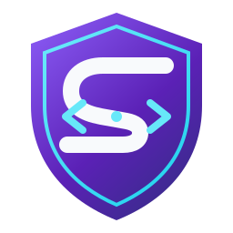
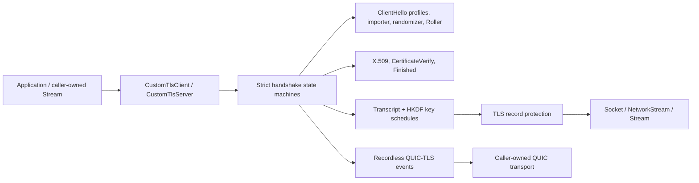

<div align="center">
  
  <h1>SharpTls</h1>
  <p><strong>Own the handshake. Shape every byte.</strong></p>
  <p>
    A pure managed C# TLS stack for .NET 9+ with uTLS-style, byte-exact
    <code>ClientHello</code> control.
  </p>
  <p>
    <a href="https://www.nuget.org/packages/SharpTls"></a>
    
    
    
    <a href="LICENSE"></a>
  </p>
</div>

---

SharpTls implements TLS directly over caller-owned `Socket`, `NetworkStream`, or
`Stream` transports. It does **not** use `SslStream`, OpenSSL, BoringSSL, native TLS
libraries, P/Invoke, proxies, external processes, or another TLS implementation.

> [!IMPORTANT]
> SharpTls is a pre-1.0 cryptographic protocol library. Its implemented surface is
> heavily tested, but independent cryptographic review and hosted release evidence
> remain explicit 1.0 gates. Read the [security policy](SECURITY.md) and
> [release-hardening gates](docs/RELEASE-HARDENING.md) before production adoption.

## Why SharpTls?

| | Capability | What you control |
|---|---|---|
| 🧬 | **Byte-exact ClientHello** | Cipher suites, extension layout and order, groups, signatures, key shares, SNI, ALPN, session ID, versions, padding and record fragmentation |
| 🎭 | **uTLS profile catalog** | 40 pinned upstream wire IDs across Chrome, Firefox, Edge, Safari, iOS, Android, 360 and QQ families, plus version-bound `Auto` aliases |
| 🧪 | **Fingerprint laboratory** | Raw extensions, GREASE, GREASE ECH, capture import, JSON v6, deterministic snapshots, coherent randomization, Roller and pre-send inspection |
| 🔐 | **Real TLS engines** | TLS 1.3 and a deliberately restricted TLS 1.2 client/server core with certificate validation, resumption, 0-RTT, KeyUpdate and exporters |
| 🕶️ | **Modern privacy and crypto** | RFC 9849 ECH, RFC 9848 HTTPS/SVCB discovery, X25519MLKEM768, delegated credentials and certificate compression |
| ⚡ | **QUIC-TLS boundary** | Recordless TLS 1.3 client/server CRYPTO-stream adapters without pretending to implement QUIC transport or HTTP/3 |

Every executable profile still goes through SharpTls's authentication and state-machine
checks. Wire fidelity never silently disables certificate validation or weakens the
secure TLS policy.

## Install

```shell
dotnet add package SharpTls --prerelease
```

Or reference the project while developing locally:

```shell
dotnet add reference src/SharpTls/SharpTls.csproj
```

## Five-minute client

```csharp
using System.Text;
using SharpTls;

var options = new CustomTlsClientOptions
{
    ServerName = "example.com",
    ClientHello = ClientHelloProfiles.Custom(builder => builder
        .WithTls13()
        .WithAlpn("http/1.1")),
};

await using var client = new CustomTlsClient(options);
await client.ConnectAsync("example.com", 443, cancellationToken);

if (client.NegotiatedApplicationProtocol is not (null or "http/1.1"))
{
    throw new InvalidOperationException("The peer selected an unsupported ALPN.");
}

var request = Encoding.ASCII.GetBytes(
    "GET / HTTP/1.1\r\nHost: example.com\r\nConnection: close\r\n\r\n");

await using var tls = client.OpenApplicationStream(leaveClientOpen: true);
await tls.WriteAsync(request, cancellationToken);

var buffer = new byte[16 * 1024];
int read;
while ((read = await tls.ReadAsync(buffer, cancellationToken)) != 0)
{
    await Console.OpenStandardOutput().WriteAsync(buffer.AsMemory(0, read), cancellationToken);
}
```

The repository includes the same flow as an executable sample, including optional ECH
DNS discovery:

```shell
dotnet run --project samples/SharpTls.Http11 -- example.com / --ech-dns
```

## Shape the exact ClientHello

```csharp
using SharpTls;
using SharpTls.Protocol;

var profile = ClientHelloProfiles.Custom(builder => builder
    .WithTls13()
    .WithCipherSuites(
        TlsCipherSuite.TlsAes128GcmSha256,
        TlsCipherSuite.TlsChaCha20Poly1305Sha256,
        TlsCipherSuite.TlsAes256GcmSha384)
    .WithGrease(ClientHelloGreasePolicy.PerSlot)
    .WithSupportedGroups(NamedGroup.X25519, NamedGroup.Secp256r1)
    .WithKeyShares(NamedGroup.X25519)
    .WithSignatureAlgorithms(
        SignatureScheme.EcdsaSecp256r1Sha256,
        SignatureScheme.RsaPssRsaeSha256)
    .WithAlpn("h2", "http/1.1")
    .WithBoringPadding()
    .WithExtensionLayout(
        ClientHelloExtensionSpec.BuiltIn(ClientHelloExtensionKind.Grease),
        ClientHelloExtensionSpec.BuiltIn(ClientHelloExtensionKind.ServerName),
        ClientHelloExtensionSpec.Raw(0xFDE8, [0x01, 0x02, 0x03]),
        ClientHelloExtensionSpec.BuiltIn(ClientHelloExtensionKind.SupportedVersions),
        ClientHelloExtensionSpec.BuiltIn(ClientHelloExtensionKind.SupportedGroups),
        ClientHelloExtensionSpec.BuiltIn(ClientHelloExtensionKind.SignatureAlgorithms),
        ClientHelloExtensionSpec.BuiltIn(ClientHelloExtensionKind.KeyShare),
        ClientHelloExtensionSpec.BuiltIn(
            ClientHelloExtensionKind.ApplicationLayerProtocolNegotiation),
        ClientHelloExtensionSpec.BuiltIn(ClientHelloExtensionKind.Padding)));

var options = new CustomTlsClientOptions
{
    ServerName = "example.com",
    ClientHello = profile,
    HandshakeFragmentation = new TlsRecordFragmentation(
        maximumFragmentSize: 4 * 1024,
        explicitFragmentSizes: [1, 5, 17, 64]),
    ClientHelloInspector = hello =>
    {
        byte[] exactHandshake = hello.GetEncodedHandshake();
        byte[] exactRecords = hello.GetEncodedTlsRecords();
        // Compare, hash, persist, or inspect caller-owned copies before transmission.
    },
};
```

The supplied mixed semantic/raw layout is the wire layout. SharpTls validates duplicate
or conflicting extensions and does not silently reorder it. A HelloRetryRequest keeps
the profile's required invariants and rebuilds the retry flight explicitly.

## Pick a fingerprint strategy

```csharp
// A pinned upstream-compatible image.
var chrome = ClientHelloProfiles.UTlsChrome133;

// Package-version-bound family aliases.
var firefox = ClientHelloProfiles.UTlsFirefoxAuto;

// A new, internally coherent fingerprint using secure runtime entropy.
var randomized = ClientHelloProfileRandomizer.CreateSecure(
    new ClientHelloRandomizationOptions
    {
        GreaseProbabilityPercent = 75,
        GreaseEchProbabilityPercent = 25,
        MaximumPaddingLength = 64,
    });

// A bounded origin-aware profile Roller.
var roller = new ClientHelloProfileRoller(new ClientHelloRollerOptions
{
    MaximumAttempts = 3,
    CacheCapacity = 256,
});

await using var client = await roller.ConnectAsync(
    new CustomTlsClientOptions { ServerName = "example.com" },
    "example.com",
    443,
    cancellationToken);
```

Roller retries only explicit peer negotiation alerts. Certificate, hostname, signature,
Finished, AEAD, malformed-input, cancellation and transport failures are never hidden
as fingerprint retries.

## Import, serialize, reproduce

```csharp
var imported = ClientHelloCapture.Import(capturedHandshakeOrRecords);
var json = ClientHelloSpecJson.Serialize(imported.Spec);
var restored = ClientHelloSpecJson.Deserialize(json);
var profile = ClientHelloProfiles.FromSpec(restored);

// Snapshot-only: fixed test keys and entropy; never transmit this output.
byte[] wire = profile.BuildDeterministicForTesting(
    serverName: "example.com",
    seed: [0x53, 0x68, 0x61, 0x72, 0x70, 0x54, 0x6C, 0x73]);
```

Capture import replaces ephemeral keys, randoms and binders with fresh coherent values
for executable connections. The JSON schema stores reusable offer policy, never traffic
secrets.

## Supported surface

| Area | Status |
|---|---|
| TLS 1.3 client and server | Implemented |
| Secure TLS 1.2 ECDHE + AEAD subset | Implemented; EMS and secure renegotiation signaling required |
| AES-128-GCM, AES-256-GCM, ChaCha20-Poly1305 | Implemented through .NET primitives |
| P-256, P-384, P-521, X25519 | Implemented |
| X25519MLKEM768 | Implemented; independent cryptographic audit remains a 1.0 gate |
| RSA-PSS, constrained RSA-PSS keys, ECDSA | Implemented |
| System chain + hostname validation | Implemented and fail-closed |
| HRR, session resumption, external PSK, 0-RTT, KeyUpdate, exporters | Implemented |
| RFC 9849 ECH + RFC 9848 discovery | Implemented for standard and recordless QUIC-TLS roles |
| Client certificates, delegated credentials, OCSP/SCT policy, certificate compression | Implemented |
| uTLS pinned profile wire IDs | 40/40 cataloged; 39 executable, exact 360/7.5 intentionally wire-only |
| QUIC TLS handshake adapter | Implemented; packets, recovery, streams and congestion control are outside scope |
| HTTP/1.1 | Interoperability sample only |
| HTTP/2, HPACK, HTTP/3, generic `HttpClient` integration | Outside the TLS library boundary |
| TLS 1.0/1.1, CBC, RC4, static RSA, SHA-1 authentication, renegotiation | Intentionally not executable |

See [uTLS parity](docs/UTLS-PARITY.md) and the
[platform/provider matrix](docs/PLATFORM-PROVIDERS.md) for the precise capability and
runtime boundaries.

## Architecture



The implementation is split into explicit protocol readers/writers, records, handshake
framing, ClientHello specifications, key exchange, key schedules, certificate logic,
client/server state machines, sessions, ECH, DNS discovery and QUIC-TLS adapters. It is
not one opaque connection class.

## Build and verify

```shell
dotnet restore SharpTls.slnx
dotnet test SharpTls.slnx --configuration Release
dotnet run --project tools/SharpTls.Fuzz --configuration Release -- --iterations 10000
dotnet run --project benchmarks/SharpTls.Benchmarks --configuration Release -- --verify
```

The hosted workflow runs the deterministic suite on Linux, macOS and Windows. Release
tags additionally require public interoperability, coverage-guided fuzzing,
byte-for-byte reproducible NuGet packages, clean-consumer restore, build provenance and
GitHub Release publication before an optional NuGet.org push.

## Documentation map

| Start here | Deep dives |
|---|---|
| [Roadmap](docs/ROADMAP.md) | [ClientHello specifications](docs/CLIENTHELLO-SPECS.md) |
| [uTLS parity](docs/UTLS-PARITY.md) | [Capture import and JSON](docs/CLIENTHELLO-IMPORT.md) |
| [Profile catalog](docs/PROFILE-CATALOG.md) | [Randomization and Roller](docs/RANDOMIZATION.md) |
| [Transports and streams](docs/TRANSPORTS.md) | [TLS 1.2 policy](docs/TLS12.md) |
| [Server engine](docs/SERVER-ENGINE.md) | [QUIC-TLS adapter](docs/QUIC-TLS.md) |
| [ECH](docs/ENCRYPTED-CLIENT-HELLO.md) | [ECH DNS bootstrap](docs/ECH-DNS-BOOTSTRAP.md) |
| [Resumption and early data](docs/RESUMPTION-EARLY-DATA.md) | [Client authentication](docs/CLIENT-AUTHENTICATION.md) |
| [Interoperability](docs/INTEROPERABILITY.md) | [Release hardening](docs/RELEASE-HARDENING.md) |
| [Threat model](docs/THREAT-MODEL.md) | [Security policy](SECURITY.md) |

## Releases

Push a SemVer tag beginning with `v` after updating the changelog:

```shell
git tag -a v0.9.0-preview.2 -m "SharpTls v0.9.0-preview.2"
git push origin v0.9.0-preview.2
```

After every release gate passes, GitHub Actions creates normalized `.nupkg` and
`.snupkg` files, attests them and attaches them to a GitHub Release. Configure NuGet
Trusted Publishing and add the NuGet profile name as `NUGET_USER` to publish with a
short-lived OIDC credential. `NUGET_API_KEY` remains an optional fallback where Trusted
Publishing is unavailable. See [the release guide](docs/RELEASING.md).

## Contributing and security

Pull requests are welcome. Start with [CONTRIBUTING.md](CONTRIBUTING.md), keep protocol
changes bounded and test hostile inputs, and record user-visible changes in
[CHANGELOG.md](CHANGELOG.md).

Please do not report vulnerabilities in a public issue. Follow
[SECURITY.md](SECURITY.md) and avoid attaching live secrets, private keys, decrypted
traffic, or unredacted captures.

## License

SharpTls is licensed under the [MIT License](LICENSE). Derived profile data and adapted
cryptographic code retain their upstream notices in
[THIRD-PARTY-NOTICES.md](THIRD-PARTY-NOTICES.md).

<div align="center">
  <sub>Built for people who need to know exactly what crossed the wire.</sub>
</div>
