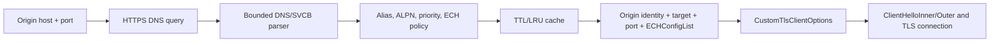

# RFC 9848 ECH DNS bootstrap

`TlsEchDnsResolver` resolves an HTTPS RRSet completely before any TLS client is created or
any ClientHello is sent. It is a separate bootstrap component: the TLS record and handshake
layers never perform implicit DNS, endpoint retries, or privacy-weakening fallback.

## Standards responsibilities

- RFC 9460 §2.2: uncompressed SVCB TargetName, strictly increasing unique SvcParam keys,
  complete value framing, and rejection of a malformed RRSet;
- RFC 9460 §§2.4–3: AliasMode selection, ServiceMode priority ordering, same-priority
  randomization, CNAME processing, bounded alias traversal, final-QNAME optional fallback,
  and preservation of the original TLS authority;
- RFC 9460 §§7–8: `mandatory`, `alpn`, `no-default-alpn`, `port`, `ipv4hint`, and
  `ipv6hint` syntax and compatibility. HTTPS uses the `http/1.1` default ALPN set and treats
  `port` and `no-default-alpn` as automatically mandatory;
- RFC 9460 §§9.1 and 9.4: HTTPS QNAME port-prefix rules and origin SNI/certificate identity;
- RFC 9848 §3: key 5 `ech` contains the entire wire `ECHConfigList`, including its length;
- RFC 9848 §§5.1–5.3: all-ECH compatible endpoint sets become ECH-reliant, SVCB affects
  ClientHelloInner, and no ClientHello is issued before discovery completes.

## Data and dependency flow

The endpoint's `OriginName` is always assigned to `CustomTlsClientOptions.ServerName`.
`TargetName` and `Port` are used only for the TCP destination. `ConfigureClient` rejects a
non-fallback endpoint if the ClientHello has no SNI slot or its ALPN list has no intersection
with the endpoint's effective HTTPS ALPN set.

## Resolver transport and bounds

The default transport uses a connected UDP socket with an EDNS(0) payload size of 1232. A
response with TC set is repeated over TCP using the DNS two-octet length frame and partial-read
loops. Callers can instead select authenticated RFC 7858 DoT or RFC 8484 DoH/HTTP-1.1. Those
modes require explicit bootstrap IPs, authenticate a separate resolver DNS name with SharpTls,
and never downgrade to port 53. DoH uses POST `application/dns-message`, transaction ID zero,
bounded HTTP framing, and adjusts DNS TTLs for HTTP `Age` and `Cache-Control: max-age`.

Each endpoint attempt has its own linked cancellation timeout. Message bytes, HTTP headers,
record count, decompressed-name length, compression pointer count, aliases, recursive servers,
cached origins, and maximum local cache lifetime are bounded by validated options.

For plaintext mode, system recursive servers are discovered from active network-interface DNS
configuration or supplied explicitly. This component is a DNS stub resolver and does not
implement recursion or DNSSEC validation. `RequireAuthenticatedData` only accepts the AD
assertion of a recursive resolver whose endpoint and channel the caller already trusts; neither
TLS nor HTTPS turns the resolver's AD assertion into local validation. See
[authenticated DoT and DoH](PROTECTED-DNS.md) for the protected bootstrap trust model.

Successful NODATA/NXDOMAIN produces an uncached authority fallback. SERVFAIL, timeout, and
transport errors fail closed by default; `AllowDirectFallbackOnDnsError` is the explicit
downgradeable opt-in. A malformed SVCB RR rejects the complete RRSet and enters non-SVCB
fallback as required by RFC 9460. A successful compatible all-ECH result never contains a
direct endpoint and reports `TlsEchDnsFallbackPolicy.EchRequired`.

## Verification gate

The deterministic suite covers the RFC 9460 Appendix D Figure 9 bytes, exact key-5 ECH values,
IDNA and non-default-port QNAMEs, unknown mandatory keys, automatically mandatory parameters,
opaque/duplicate ALPN identifiers, IP hints, malformed/truncated RDATA, hostile compression
pointers, response/question/transaction mismatches, alias selection/loops/depth, final-QNAME
fallback, ECH-reliant and mixed endpoint sets, DNS AD/error policy, TTL expiry and cache reuse.
Loopback transport tests force UDP truncation, then fragment both the TCP length prefix and DNS
body across reads. Separate authenticated managed DoT/DoH tests cover one-byte fragmentation,
HTTP transfer framing, hostile inputs, cancellation, and cache-age normalization. Opt-in public
tests authenticate Google DoT and Cloudflare DoH and complete accepted ECH after DoH bootstrap.
The full repository build treats warnings and analyzers as errors.
