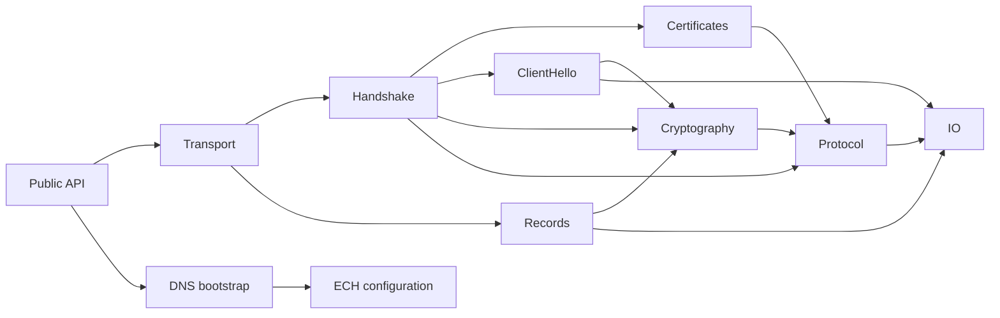

# SharpTls engineering roadmap

## Standards baseline and scope

RFC 9846 (July 2026) is the normative TLS 1.3 baseline and takes precedence over every older TLS 1.3 text. RFC 8446 is used only where an older protocol vector such as RFC 8448 necessarily refers to it; RFC 9846 §1.2 is tracked explicitly in [the standards-delta checklist](RFC9846-COMPLIANCE.md). Supporting RFCs include RFC 6066 (SNI), RFC 7301 (ALPN), RFC 8701 (GREASE), RFC 5280 (PKIX), RFC 9525 (service identity), and RFC 9963 (TLS 1.3 legacy PKCS #1 code points).

The first production target was a non-PSK TLS 1.3 client using the three mandatory/requested AEAD suites, P-256/P-384 ECDHE, system trust, RSA-PSS/ECDSA server authentication, SNI, ALPN, HRR, compatibility CCS tolerance, configurable record fragmentation, and authenticated application data. That target, the restricted TLS 1.2 phase, and TLS 1.3 ticket resumption/0-RTT are complete. The HTTP/1.1 sample proves that the resulting stream carries real application traffic; it is not an HTTP-client feature of the library. Remaining deferred features stay explicit and are not advertised as supported.

## Architecture

```text
src/SharpTls/
  Protocol/       Wire enums, limits, alerts, immutable messages
  IO/             Bounds-checked big-endian reader/writer
  Records/        TLSPlaintext/TLSCiphertext framing, fragmentation, AEAD state
  Handshake/      Deframing, transcript, strict client state machine, parsers
  ClientHello/    Ordered extension objects, profiles, deterministic generation
  Ech/            ECHConfig, HPKE contexts, inner/outer construction, acceptance
  Dns/            RFC 9460 HTTPS/SVCB wire codec and RFC 9848 ECH bootstrap policy
  Cryptography/   ECDHE providers, HKDF, key schedule, AEAD suites, secret owners
  Certificates/   TLS Certificate parser, chain/name/signature validation
  Sessions/       TLS 1.3 ticket parsing, bounded cache, replay-aware early-data API
  CustomTls*.cs    Public options and transport orchestration
tests/SharpTls.Tests/
  subfolders      Codec, parser, state, crypto vector, and negative tests
  Interop/        Opt-in real-server tests
samples/SharpTls.Http11/
  Program.cs      Minimal HTTP/1.1 request using application-data APIs
docs/
  INTEROPERABILITY.md  Opt-in real-server and non-secret pcap procedure
```

The compile-time dependency direction is:



No lower layer calls the public client or transport orchestration. Parsers are pure over bounded memory. Stateful I/O and cryptographic state are separate so malformed-input tests do not require sockets.

## Major interfaces

- `CustomTlsClient` owns connection lifetime and exposes connect/read/write/close operations.
- `CustomTlsClientOptions` is mutable only as input; construction validates and snapshots an immutable handshake configuration.
- `ClientHelloBuilder` produces an immutable ordered built-in extension profile and preserves that order exactly.
- `IRandomSource` separates secure runtime entropy from an explicitly enabled deterministic test source.
- `IKeyShare` owns one ephemeral private key and exports/derives exactly one named-group share.
- `TlsRecordReader`/`TlsRecordWriter` perform only framing; `Tls13RecordCipher` owns AEAD keys, IVs, and sequence numbers.
- `HandshakeDeframer` reconstructs messages across records; `Tls13ClientStateMachine` is the sole authority for legal message transitions.
- `Tls13KeySchedule` derives labeled secrets; `TranscriptHash` owns exact handshake bytes.
- `ServerCertificateValidator` composes system PKIX/name checks with TLS CertificateVerify verification.

## Milestones and gates

### 1. Project architecture and protocol models

Responsibility: establish public/internal boundaries, wire constants, resource limits, alert-bearing exceptions, immutable inputs, and the strict state graph. RFC 9846 §§2, 4, 5, 6, Appendix A.

Tests/gate: enum wire values, legal state paths, every illegal transition, option snapshot immutability, and clean `net9.0` build with warnings as errors.

### 2. Big-endian TLS binary reader/writer

Responsibility: encode/decode unsigned 8/16/24/32/64-bit integers and length-prefixed vectors without unchecked slicing or hidden allocations. RFC 9846 §3.

Tests/gate: boundary round-trips, maximum 24-bit values, truncated prefixes/payloads, enclosing-vector violations, overflow attempts, trailing-data rejection.

### 3. TLS record layer and handshake framing

Responsibility: partial reads, strict TLSPlaintext limits, record emission/fragmentation, compatibility CCS classification, handshake reassembly across arbitrary record boundaries. RFC 9846 §§4, 5, 5.1, Appendix E.4.

Tests/gate: byte-at-a-time streams, EOF at every header/payload position, oversized records/messages, zero-length records, coalesced and fragmented handshakes, cancellation.

### 4. Custom ClientHello and ordered extensions

Responsibility: byte-exact ClientHello generation with caller-controlled cipher suites, SNI, ALPN, supported versions/groups/signatures, key shares, GREASE, padding, session ID, and extension order. RFC 9846 §§4.2.2, 4.3, 9.2; RFC 6066 §3; RFC 7301 §3; RFC 8701.

Tests/gate: golden byte strings, deterministic generation, duplicate/illegal extension rejection, SNI/ALPN length/encoding attacks, exact order assertions, secure-default entropy smoke test.

### 5. ECDHE and key-share management

Responsibility: generate/import P-256/P-384/P-521 uncompressed points through .NET providers and X25519 through the managed RFC 7748 fallback required by .NET 9. Every connection gets newly generated shares; reuse is forbidden. RFC 9846 §§1.2, 4.3.7, 4.3.8, 7.4.2; RFC 7748.

Tests/gate: two-party agreement, public encoding dimensions, invalid/off-curve/truncated point rejection, single-use/disposal behavior, known vectors where provider import permits.

### 6. HKDF key schedule and transcript hashing

Responsibility: implement HKDF-Extract/Expand and HKDF-Expand-Label, exact transcript hashing, early/handshake/main/application secret derivation, Finished keys, traffic keys and IVs. RFC 9846 §§4.1, 7.1, 7.2, 7.3; RFC 5869.

Tests/gate: RFC 5869 vectors, RFC 8448 handshake vectors, SHA-256/SHA-384 paths, label/context bounds, secret zeroization tests.

### 7. ServerHello and HelloRetryRequest

Responsibility: parse/validate negotiated version, suite, session echo, extension legality, selected key share; detect HRR random, reconstruct `message_hash`, emit a constrained second ClientHello. RFC 9846 §§4.1, 4.2.3, 4.2.4, 4.3.8.

Tests/gate: normal/HRR golden messages, unoffered suite/group/version, duplicate extensions, forbidden HRR changes, second HRR, invalid session echo.

### 8. Encrypted handshake records

Responsibility: AES-GCM/ChaCha20-Poly1305 record protection, nonce sequence, inner content type and zero padding, encrypted record limits, alerts and compatibility CCS handling. RFC 9846 §§5.2, 5.3, 5.4.

Tests/gate: RFC 8448 records, all padding lengths, tampered tag/AAD/ciphertext, missing content type, non-zero forbidden framing, sequence exhaustion.

### 9. Server authentication

Responsibility: parse EncryptedExtensions, Certificate, and CertificateVerify; build system chain with server-auth EKU; perform platform-neutral hostname matching; verify TLS 1.3 context signature for RSA-PSS and ECDSA. RFC 9846 §§4.4.1, 4.5.1, 4.5.2; RFC 5280; RFC 9525; RFC 9963.

Tests/gate: generated test PKI for valid/expired/wrong-name/untrusted/missing-EKU chains, malformed DER/list lengths, wrong signature context/hash/key type, RSA-PSS and ECDSA positives.

### 10. Finished

Responsibility: constant-time server Finished verification, transcript update in the correct order, client Finished generation, and main/application secret transition. RFC 9846 §§4.5.3, 7.1.

Tests/gate: RFC 8448 vector, single-bit corruption, wrong transcript, wrong hash/suite, illegal early application data.

### 11. Application-data transport

Responsibility: authenticated application writes/reads, alerts, close_notify at warning level, `user_canceled` handling, bounded buffering, fragmentation, cancellation, EOF/truncation semantics. RFC 9846 §§5, 6.1, 6.2.

Tests/gate: partial-I/O harnesses, many record sizes, close_notify, fatal alert, abrupt EOF, tampered traffic, and single-reader/single-writer enforcement.

### 12. HTTP/1.1 interoperability example

Responsibility: demonstrate authenticated application traffic, complete reads, and negotiated ALPN checks with the smallest practical protocol example. The sample is not a reusable HTTP stack and is not part of the TLS public API. RFC 9112 plus TLS APIs.

Tests/gate: compile-ready example and opt-in public-server HTTP/1.1 smoke tests.

### 13. Verification and interoperability

Responsibility: protocol vectors, hostile corpus, packet captures, deterministic ClientHello snapshots, CI matrix, and real TLS 1.3 servers. RFC 8448 vectors interpreted through RFC 9846 §1.2, plus RFC 9846 Appendix C.

Tests/gate: Linux/macOS/Windows .NET 9 matrix; AES-128/AES-256/ChaCha where available; P-256/P-384; HRR fixture; visible-wire packet captures; zero analyzer warnings. Fuzzing begins with parsers and deframers and runs with allocation/time ceilings. Decryptable key-log capture was subsequently implemented as the explicit-risk phase-26 diagnostic surface.

## Implementation status — 2026-07-18

Milestones 1–12 are implemented in compile-ready code with focused positive and
negative tests. Milestone 13 has RFC 5869/RFC 8448 vectors, deterministic snapshots,
a 10,039-input deterministic hostile-corpus run (39 structural seeds plus 10,000 mutations),
packet-capture instructions, a three-OS CI workflow,
and opt-in interoperability tests. The latter pass complete handshakes and HTTP/1.1
traffic against `example.com` and `www.google.com`, including all three supported
AEAD suites, all three implemented NIST groups across the matrix, and a forced HRR path.

This is a security-sensitive pre-1.0 implementation. The workflow has been authored
but has not yet produced hosted Linux/Windows/macOS CI evidence in this workspace,
and the independent external security review in the release gates remains open.

Phases 27 and 28 are feature-complete in the managed implementation. The recordless
QUIC-TLS client/server adapters cover CRYPTO reassembly, encryption-level secrets,
transport parameters, HRR, client authentication, ticket resumption and replay-gated
QUIC 0-RTT without implementing QUIC transport. The standard server covers TLS 1.3
and the secure TLS 1.2 subset, certificate selection, client authentication,
session-ID/stateless-ticket resumption, KeyUpdate, exporters, OCSP/SCT presentation,
RFC 8879 certificate compression, orderly shutdown and listener ownership. External
multi-stack evidence and independent review remain phase-29 release gates rather than
missing protocol features.

Phase 14 is complete: immutable `ClientHelloSpec`, mixed semantic/raw extension
layouts, exact order and snapshotting, HRR preservation, hostile-input checks and a
real-server private-use extension test are implemented. Phase 15 is complete with
caller-owned duplex transports, standard Stream semantics, ownership tests,
concurrent read/write and fatal-alert handling. Phase 16 includes bounded bare and
record-fragmented capture import plus strict version-3 JSON interchange with v1/v2
compatibility. Additional contemporary captures remain gated on executable algorithms
and semantic extensions. Phase 17 is complete with runtime-filtered
coherent randomization, arbitrary GREASE equality policies, deterministic property
and distribution tests, bounded peer-negotiation retry, a thread-safe origin LRU,
and public-server interoperability.
Phase 19 includes complete P-521 ECDHE/ECDSA-P521-SHA512, managed RFC 7748
X25519, FIPS 203 ML-KEM-768, standards-track X25519MLKEM768, and the historical
X25519Kyber768Draft00 compatibility construction. Official/accumulated vectors,
hostile-input tests and TLS/QUIC client-server agreement cover these paths. EdDSA remains unadvertised because
.NET 9 lacks the required portable runtime primitive. Phase 22 is complete with bounded
KeyUpdate, automatic AEAD-limit rotation, RFC 9846 exporters, RSA/ECDSA initial client
authentication for TLS 1.2/1.3, and opt-in TLS 1.3 post-handshake authentication.
Phases 18/24 include all 40 source-pinned upstream uTLS IDs across Chrome 58–133,
Firefox 55–148, Edge 85/106, iOS 11.1–14, Safari 16/26.3, Android 11 OkHttp, 360 and QQ,
including Chrome 100/112/114 PSK/shuffle/padding variants, plus dual GREASE slots,
mixed-version offers, legacy ALPS-aware Chrome tables, Boring padding, RFC 8879
Brotli/Zlib decompression, OCSP/SCT CertificateEntry parsing, fixed full-wire snapshots,
capture/JSON round trips and public-server evidence for all 39 securely executable
profiles against two independent deployments. The exact 360/7.5 capture remains a
deterministic wire-only profile because it predates Extended Master Secret; accepting
that TLS 1.2 image would violate the project security boundary. Phase 20 adds the separate
TLS 1.2 transcript/state/PRF path, authenticated ECDHE_RSA/ECDHE_ECDSA, AES-GCM and
ChaCha20-Poly1305 records, mandatory EMS/secure-renegotiation signalling, mixed-version
dispatch, HTTP/1.1 traffic, and Android 11 OkHttp public-server evidence. Phase 21 is
complete with an origin/port/ALPN/hash-bound concurrent ticket cache, single-use ticket
ownership, `psk_dhe_ke` binders, HRR binder reconstruction, resumed state transitions,
authentication-lifetime propagation, explicit replay acknowledgement, accepted and
rejected 0-RTT flows, and opt-in authenticated retransmission. RFC 8448 vectors, a
managed loopback peer, and independent `example.com`/Google resumption passes cover the
phase gates.

## uTLS-class expansion roadmap

The long-term target is feature parity with the safe, client-facing capabilities of
uTLS while retaining SharpTls's defining constraint: the protocol is implemented in
managed C# over caller-controlled transports and never delegates the handshake to
`SslStream` or another TLS implementation. The live feature comparison is tracked in
[UTLS-PARITY.md](UTLS-PARITY.md).

Parity does not mean reproducing APIs which permit fabricated traffic secrets or
otherwise make an apparently authenticated connection without a real handshake.
SharpTls will provide deterministic wire snapshots, legitimate session import/export,
and explicitly dangerous diagnostic secret logging, but it will not accept arbitrary
master secrets as a production connection shortcut.

### 14. Extensible ClientHello specification

Responsibility: replace the closed built-in extension list with an immutable
`ClientHelloSpec` model that can mix semantic built-ins and opaque raw extensions in
an exact caller-provided order. Raw values are snapshotted and bounded; duplicate
wire types, collisions with semantic built-ins, and unsafe acknowledgement by a
server fail closed. RFC 9846 §§4.2, 4.3, 4.3.1 and 9.2; RFC 8701.

Tests/gate: byte-exact mixed layouts, raw-data snapshotting, duplicate/collision and
oversize negatives, deterministic output, HRR preservation, and a real server which
ignores a private-use extension.

### 15. Transport and Stream integration

Responsibility: allow a caller-owned connected `Socket`, `Stream`, or duplex
transport; expose an idiomatic `Stream` with arbitrary-size partial reads, buffered
record plaintext, writes, cancellation, half-close policy, and ownership controls.
Keep one-reader/one-writer concurrency explicit. RFC 9846 §§5 and 6.1.

Tests/gate: in-memory duplex transport, byte-at-a-time reads/writes, cancellation at
every boundary, concurrent read/write, caller-owned lifetime, fatal-alert emission,
truncation, and `Stream` contract tests.

### 16. Captured ClientHello import and specification interchange

Responsibility: parse a complete TLS record or bare ClientHello into an immutable
specification; preserve unknown extensions and ordering; export/import a versioned
JSON representation without importing ephemeral key material, binders, random, or
session secrets. RFC 9846 §§4.2 and 4.3.

Tests/gate: Chrome/Firefox/Safari capture corpus, record-fragment reassembly,
round-trip structural equality, hostile JSON/wire inputs, normalization rules, and
explicit reporting for fields that must be regenerated securely.

### 17. Secure fingerprint randomization and profile rolling

Responsibility: generate only internally coherent randomized profiles, with weighted
suite/extension/group choices, ALPN/no-ALPN variants, GREASE slot policies, dynamic
padding, stable seeded test output, and a bounded Roller that caches a successful
profile per origin. Retry policy never weakens certificate validation. RFC 8701;
RFC 9846 Appendix C.

Tests/gate: property tests proving every randomized offer is executable, statistical
sanity checks, deterministic seed vectors, bounded retries/backoff, cache isolation,
and no retry on authentication or certificate failures.

### 18. Maintained browser and application profiles

Responsibility: ship versioned Chrome, Firefox, Safari/iOS, Edge and Android/OkHttp
profiles sourced from reviewed packet captures. Each profile declares semantic,
cosmetic, unsupported, and application-layer dependencies; `Auto` aliases are updated
only with new capture evidence. No profile claims mimicry beyond tested TLS-visible
behavior.

Tests/gate: committed pcap metadata and byte masks, JA3/JA4-style structural
snapshots, GREASE-variable masks, ALPN/application-protocol dependency metadata, and public-server
interoperability for every advertised profile.

### 19. TLS 1.3 algorithm and authentication breadth

Responsibility: add X25519, P-521, Ed25519/Ed448 and RSA-PSS-PSS as runtime
primitives permit, plus standards-track hybrid post-quantum groups. Runtime primitives
are preferred; a managed implementation is permitted only where the target runtime lacks
the required primitive and must pass published vectors, strict review and audit gates.
RFC 9846 §§4.2.3, 4.3.7, 4.3.8 and
4.5.2; applicable group/signature RFCs.

Tests/gate: official vectors, provider/platform capability matrix, invalid public
keys/signatures, profile fallback, constant-time secret selection, zeroization,
multi-stack interoperability, and independent review of managed cryptography.

Implemented: managed fixed-iteration X25519, managed FIPS 203 ML-KEM-768 with a
FIPS 202 fallback, X25519MLKEM768, X25519Kyber768Draft00, and runtime-backed P-521;
RSA-PSS-PSS
for TLS 1.2/1.3 server authentication and client CertificateVerify, including strict
SPKI OID/hash/MGF1/salt/trailer constraints and a managed authenticated TLS 1.3
application-traffic loopback. Ed25519/Ed448 remain unadvertised because .NET 9 has
no portable runtime primitive and SharpTls does not substitute custom EdDSA.

### 20. Production TLS 1.2 client

**Status: complete for authenticated full/abbreviated handshakes and application traffic.**
Phase 25 adds bounded stateful session-ID and stateless RFC 5077 ticket resumption,
including ticket renewal in the authenticated Finished transcript.

Responsibility: implement a separate strict TLS 1.2 state machine, ECDHE_RSA and
ECDHE_ECDSA AEAD handshakes, EMS, secure renegotiation signalling, downgrade
protection, session tickets, and profile-controlled TLS 1.2 ClientHello fields.
Legacy CBC, RC4, static RSA key exchange and insecure renegotiation remain disabled.
RFC 5246, RFC 5746, RFC 7627, RFC 7905 and RFC 9846 §D.5.

Tests/gate: published vectors, cross-version downgrade/HRR confusion negatives,
TLS 1.2 public/local stacks, EMS required by default, renegotiation rejection, and
separate TLS 1.2/1.3 transcript and secret-lifetime review.

### 21. Session tickets, PSK resumption and 0-RTT

**Status: complete for TLS 1.3 resumption PSKs and explicitly enabled early data.**

Responsibility: fully parse NewSessionTicket, maintain an origin-bound concurrent
LRU session cache, construct PSK identities and binders, resume across HRR, enforce
ticket age/lifetime, and expose opt-in replay-aware early data with an application
accept/reject contract. RFC 9846 §§2.2, 4.2.4, 4.2.9–4.2.11, 4.3.11, 4.7 and 8.

Tests/gate: binder vectors, ticket corruption/expiry/origin isolation, HRR hash
binding, replay policy, early-data rejection and retransmission, concurrent cache
access, and real resumption across multiple independent servers.

### 22. Post-handshake lifecycle and client authentication

**Status: complete for static caller-owned RSA/ECDSA credentials, TLS 1.3 PHA,
KeyUpdate, exporters, and orderly shutdown.**

Responsibility: KeyUpdate with RFC usage limits and request bounds, post-handshake
messages, initial and post-handshake client certificates, certificate selection,
client CertificateVerify, exporters, unique channel binding where defined, and
orderly bidirectional shutdown. RFC 9846 §§4.5, 4.6, 4.7, 6.1, 7.5 and 7.6.

Tests/gate: crossed KeyUpdates, update floods, long-running traffic, RSA/ECDSA client
certificates, empty-certificate paths, exporter vectors, close races, and secret
replacement zeroization.

### 23. Advanced TLS-visible browser extensions

**Status: complete for the uTLS-visible extension baseline. `signature_algorithms_cert`, asymmetric `record_size_limit`, RFC 9345
server delegated-credential authentication, experimental uTLS-compatible
ALPS/application_settings, the RFC 9849 ECH connection path, and RFC 9848 DNS bootstrap
are implemented.**

Responsibility: semantic handlers for OCSP status_request, SCT, certificate
compression, signature_algorithms_cert, record_size_limit, delegated credentials,
experimental ALPS/application_settings and RFC 9849 ECH/GREASE-ECH. Cosmetic raw extensions remain
distinct from negotiated handlers. Relevant RFCs include RFC 6066, RFC 6962,
RFC 8879, RFC 8449, RFC 9345, RFC 9460, RFC 9846, RFC 9848, and RFC 9849. ALPS is based on the
expired `draft-vvv-tls-alps-01`; it is implemented only for uTLS wire compatibility
and is not represented as an IETF standard.

Tests/gate: extension-specific vectors and decompression bounds, server-response
parsing, ECH retry/config validation, duplicate/context negatives, and profiles may
enable an extension only when its full response path is implemented.

Completed gates in this phase:

- independent, ordered `signature_algorithms_cert` authoring/import/JSON and strict
  CertificateRequest parsing;
- RFC 8449 limits in TLS 1.3 EncryptedExtensions and TLS 1.2 ServerHello;
- send-side application and protected-handshake fragmentation, receive-side
  `record_overflow`, TLS 1.3 type/padding accounting, and prior-session limit binding
  for 0-RTT records;
- asymmetric managed-peer interop, hostile oversized authenticated records, malformed
  extension vectors, and a real-server Firefox-profile smoke test.
- ordered delegated-credential advertisement/import/JSON, leaf CertificateEntry
  parsing, DelegationUsage/key-usage/lifetime, ECDSA and RSA-PSS-PSS SPKI/signature validation, delegated-key
  CertificateVerify, resumption lifetime capping, and positive/negative managed interop;
- ordered ALPS protocol advertisement/import/JSON for code points 17513 and 17613;
  strict ALPN/codepoint/early-data validation; server settings withheld until authenticated
  Finished; client EncryptedExtensions included before client authentication and Finished;
  and deterministic managed TCP interop for both experimental variants.
- strict, bounded RFC 9849 `ECHConfigList` parsing and wire-preference selection;
  RFC 9180 base-mode X25519, P-256, P-384 and P-521 HPKE with AES-128-GCM,
  AES-256-GCM and runtime ChaCha20-Poly1305; NIST curves use runtime ECDH,
  RFC 9180 deterministic key derivation, strict SEC1 points, official P-256/P-521
  sender/receiver vectors, and a deterministic P-384 round trip;
- independently ordered ClientHelloInner/ClientHelloOuter construction, encrypted inner
  padding, exact AAD reconstruction, same-context one-HRR retry, retry cookies, acceptance
  confirmation for initial ServerHello/HRR/post-HRR ServerHello, and constant-time checks;
- authenticated accept and reject managed-peer interop: accepted ECH binds the private
  certificate, inner transcript and key share; rejected ECH binds the public certificate,
  suppresses client identity and application state, sends protected `ech_required`, and
  returns authenticated retry configurations only through `TlsEchRejectedException`.
- deterministic managed end-to-end ECH HRR interop with same-context HPKE sequence reuse,
  empty second `enc`, preserved retry identity, P-384 reselection, post-HRR confirmation,
  client authentication, Finished verification, and application traffic;
- RFC 9849 GREASE ECH with randomized plausible HPKE suites, random config IDs, valid
  X25519 encapsulated keys, length-shaped random payloads, exact HRR copying, syntactic-only
  retry-config validation, normal resumption eligibility, and public-handshake interop.
- bounded `ech_outer_extensions` authoring with pre-network contiguity/relative-order
  validation, exact inner/outer body equality, true-inner transcript preservation, linear
  managed-peer expansion, amplification-resistant duplicate/missing/order checks, and
  direct plus HRR end-to-end coverage.
- RFC 9848 bootstrap over RFC 9460 HTTPS records with a strict DNS codec, EDNS(0),
  cancellable UDP/TCP, authenticated RFC 7858 DoT, and RFC 8484 DoH/HTTP-1.1;
  CNAME/AliasMode traversal and limits,
  ServiceMode mandatory-key/ALPN compatibility, exact `ech` values, secure endpoint and
  IP-hint shuffling, origin-SNI preservation, ECH-reliant fallback suppression, and a
  bounded thread-safe TTL/LRU cache. RFC 9460 Appendix D, hostile wire, alias-policy,
  cache-expiry, DNS-error and fragmented loopback TCP tests cover the phase gate.
- strict protected-resolver bootstrapping with explicit IP endpoints, resolver-name PKIX,
  no plaintext downgrade, bounded DNS/HTTP framing, HTTP Age/max-age TTL adjustment,
  fragmented managed DoT/DoH loopback tests, independent Google/Cloudflare resolver
  interoperability, and an accepted public Cloudflare ECH handshake.
- RFC 9849 PSK privacy and early data: accepted ECH tickets are bound to the exact
  `ECHConfigList` source; actual identities and authenticated binders occur only in Inner;
  Outer uses length-matched random GREASE PSKs and mirrors early_data; HRR recomputes the
  inner binder; rejected Outer selection is fatal; and private early bytes are never
  retransmitted to the public-name connection. Managed issue/resume, 0-RTT, HRR and hostile
  rejection tests cover the complete cache-to-wire path.

Client delegated-credential sending is completed in phase 25 rather than counted in
this extension-receive phase.

ALPS combined with 0-RTT is complete: authenticated NewSessionTicket processing and
encrypted persistence bind the selected code point and both opaque settings payloads;
unbound legacy tickets cannot send early data, and changed resumed settings fail with
`illegal_parameter`. Managed TCP issue/resume and hostile-mismatch tests cover the path.
ECH currently requires TLS-1.3-only inner and outer profiles. Protected DNS and public
accepted-ECH gates are complete. HTTP/2 and connection pooling are application/resolver
transport concerns and are not core uTLS-parity gates. See
[the ECH design and limits](ENCRYPTED-CLIENT-HELLO.md).

### 24. Current profile corpus and uTLS-style client API closure

**Status: complete for the pinned upstream profile baseline. The defensive pre-send ClientHello observer is implemented for
initial and HelloRetryRequest flights, including direct, ECH-outer and GREASE-ECH wire
forms, exact planned record bytes, versions and fragment boundaries. Capture import
retains source record boundaries and normalizes visible ECH outer values to fresh semantic
GREASE ECH. Randomizer profiles include conditional PSK/0-RTT slots and configurable
ALPS/GREASE-ECH; Roller uses the uTLS family pool and carries the full client policy to
each compatible candidate. Version-bound family `Auto` aliases resolve to the newest executable profile
shipped by this package. All 40 concrete IDs in the pinned upstream table are present;
39 are connection-executable, while 360/7.5 is explicitly wire-only because its exact
legacy image omits mandatory Extended Master Secret.
Chrome shuffling, GREASE ECH, both hybrid key-share formats, shared X25519 components,
ALPS 17513/17613, deterministic generation, HRR/order invariants and JSON v6 round
trips are covered.**

Responsibility: expand the capture-backed Chrome, Chromium/Edge, Firefox,
Safari/iOS and Android application profile corpus; add evidence-backed `Auto` aliases;
and provide a stable API for selecting, importing, randomizing, rolling, building and
inspecting a ClientHello before it is sent. Every shipped profile must distinguish
wire-exact fields, regenerated entropy, semantic extensions and ALPN dependencies.
An alias advances only in a versioned release after its target profile passes the same
executable-path and interop gates as a pinned ID. RFC 9846 §§4.2–4.3; RFC 8701.

Tests/gate: source hashes and attribution, masked full-wire snapshots, structural
fingerprints, deterministic entropy vectors, capture/JSON round trips, alias-version
tests, public-server interop, and fail-closed rejection when a profile contains a
negotiable semantic feature the connection engine cannot execute.

### 25. Remaining production client-side TLS breadth

**Status: complete for the advertised safe client surface. Authenticated encrypted TLS 1.3 cache persistence, decrypt-key
rotation, fail-closed RFC 8446 external PSK authentication, hash-correct multiple PSK
identities, bounded TLS 1.2 session-ID/RFC 5077 abbreviated handshakes, async credential
selection, SPKI-bound hardware/runtime signer abstraction, RFC 9345 client delegated
credentials, ALPS-bound 0-RTT, and hybrid PQ groups are complete. Provider-gated EdDSA and native
RFC 9162 CT-v2 remain explicitly unadvertised future standards work.**

Responsibility: close legitimate client-side state and authentication gaps: encrypted
persistent session-ticket import/export, external TLS 1.3 PSKs, TLS 1.2 resumption,
asynchronous certificate-selection and hardware/runtime signer interfaces, client
delegated credentials, ALPS-to-ticket binding for 0-RTT, and complete configurable
OCSP/SCT policy. EdDSA remains provider-gated. Managed post-quantum code is limited to
FIPS 203/202 because .NET 9 lacks portable primitives and remains subject to phase-29 audit.
Relevant specifications include RFC 9846 §§2.2, 4.2.11, 4.4 and 8; RFC 5077,
RFC 6962 and RFC 9345.

Tests/gate: authenticated serialization and key rotation, origin/ALPN/ECH binding,
ticket expiry and corruption, PSK binder vectors, cross-version confusion negatives,
signer cancellation and concurrency, hostile certificate-status inputs, provider
capability matrices, and multi-stack interoperability for every advertised path.

ALPS-to-ticket binding is complete, including persistence-format compatibility, exact
client-setting cache eligibility, resumed peer-setting validation, automatic
NewSessionTicket capture, and accepted/hostile managed-TCP 0-RTT coverage. It remains
listed in the phase responsibility for traceability rather than as open work.

Multiple PSK identities are complete for ticket resumption: the caller bounds the offer
count, the cache atomically supplies tickets in preference order, SHA-256/SHA-384 and
HRR binders use identity-specific transcripts, ECH outer GREASE mirrors the complete
shape, the selected server index controls the key schedule and authentication lifetime,
and only identity zero can authorize early data. Mixed-hash vectors plus managed-TCP
second-identity and early-ticket-promotion tests cover the path.

Client delegated credentials are complete for initial TLS 1.3 and post-handshake
authentication. A caller attaches a pre-issued credential and separate caller-owned
signer to its delegation certificate. SharpTls validates DelegationUsage, lifetime,
client-context delegation signature, exact delegated SPKI/curve or PSS constraints,
requires the delegation signature algorithm in `signature_algorithms` and the delegated
CertificateVerify algorithm in the CertificateRequest `delegated_credential` list,
encodes extension 34 only on the leaf CertificateEntry, and signs asynchronously with
the delegated key. Unit/hostile tests and managed TCP initial/PHA interop cover the path.

Additional OCSP/SCT policy is implemented as an async, cancellable gate after mandatory
system chain and hostname validation. It receives defensive authenticated evidence,
cannot override trust failures, supports required-good OCSP and minimum valid-SCT counts,
maps revoked/invalid/callback failures to precise fatal alerts, and rejects incoherent
requirements before network I/O. Managed TCP positive and hostile-invalid-staple tests
cover the path. The callback owns responder/log-list cryptographic policy; SharpTls does
not equate evidence presence with validity. Native RFC 9162 CT v2 `transparency_info`
authoring, parsing and validation remain an open phase-23 standards-delta item.

### 26. Safe diagnostics and controlled low-level access

**Status: complete. Immutable redacted connection snapshots, defensive certificate/
OCSP/SCT/ALPS/ECH results, serialized secret-free handshake events, and the explicitly
acknowledged caller-owned NSS key-log sink are implemented and tested.**

Responsibility: expose immutable negotiated connection state, certificate/OCSP/SCT/
ALPS/ECH outcomes, redacted handshake events, and pre-send ClientHello bytes. An
explicitly dangerous NSS key-log sink may copy only the standard debugging secrets
needed by packet analyzers and is disabled by default. Production APIs never permit
arbitrary master-secret injection, fabricated authentication, or mutation of live
transcript, traffic-secret, sequence-number, or AEAD state.

Tests/gate: no-secret default logs, immutable snapshot tests, event ordering,
reentrancy protection, exact key-log vectors, explicit risk acknowledgement,
Wireshark-decryptable opt-in captures, bounded callback behavior, and zeroization of
temporary secret copies.

### 27. QUIC TLS handshake adapter

**Status: complete for the recordless TLS client/server surface. External
multi-transport qualification remains a phase-29 release gate.**

Responsibility: expose the TLS 1.3 handshake as a recordless encryption-level state
machine suitable for a separate QUIC transport implementation. The adapter accepts
and emits CRYPTO-stream handshake bytes, ordered QUIC transport parameters, traffic
secret transitions and discard events without implementing QUIC packets, recovery,
congestion control, streams, QPACK or HTTP/3. RFC 9001 and RFC 9000 §18.

Tests/gate: published QUIC-TLS vectors, Initial/Handshake/0-RTT/1-RTT transition
ordering, fragmented and duplicated CRYPTO input, transport-parameter bounds and
duplicates, Retry/HRR interaction, exact secret-discard timing, and interoperability
with at least two independent QUIC transports through an external harness.

Implemented: client and server CRYPTO-stream reassembly with overlap/gap/limit checks;
Initial, Handshake and Application offsets; traffic-secret and discard events; QUIC v1
and v2 initial/packet key derivation; strict transport-parameter parsing and role rules;
full, HRR and mutual-authentication handshakes; stateless protected tickets; PSK binder
verification across HRR; authenticated post-handshake ticket delivery; and opt-in 0-RTT
whose server acceptance requires an atomic application anti-replay callback and
nondecreasing remembered transport limits. RFC 9849 direct/HRR ECH acceptance,
authenticated rejection/retry configurations, ECH-bound resumption and matching Inner-bound
0-RTT secrets are implemented for both roles. TLS KeyUpdate is rejected as QUIC requires.
QUIC packets, Retry integrity, loss recovery, congestion control, streams and HTTP/3
remain caller/transport responsibilities.

### 28. Standard TLS server engine

**Status: complete for TLS 1.3 and the documented secure TLS 1.2 subset. External
multi-client qualification remains a phase-29 release gate.**

Responsibility: implement separate strict TLS 1.3 and secure TLS 1.2 server state
machines over caller-owned `Socket`/`Stream` transports. Server scope includes
SNI/ALPN certificate selection, RSA/ECDSA authentication, optional client
authentication, tickets/resumption, KeyUpdate, exporters,
orderly shutdown and listener/accepted-stream helpers. It does not add a server-side
fingerprint-mimicry API because uTLS's specialized fingerprint surface is
ClientHello/client-side. RFC 9846 Appendices A/C and the restricted RFC 5246 policy.

Tests/gate: exhaustive state transitions and malformed ClientHello corpus, certificate
selection, client-auth positive/negative paths, ticket-key rotation and anti-replay,
crossed KeyUpdates, cancellation/ownership, SharpTls-client differential tests, and
interoperability with at least two independent TLS client stacks.

Implemented: strict version dispatch; RSA/ECDSA SNI/ALPN-aware credential selection;
all advertised TLS 1.3 and six ECDHE+AEAD TLS 1.2 suites; HRR; initial client
authentication; TLS 1.3 stateless ticket resumption; TLS 1.2 bounded session-ID and
RFC 5077 stateless-ticket resumption; TLS 1.2/1.3 exporters; TLS 1.3 KeyUpdate;
fragmented application transport and close alerts; optional stapled OCSP/SCT evidence;
offered-only Zlib/Brotli CompressedCertificate; and an ownership-safe cancellable TCP
listener. TLS 1.3 also accepts caller-owned RFC 9849 ECH keys, reconstructs and negotiates
Inner, confirms direct/HRR acceptance, authenticates Outer on rejection, and emits selected
retry configurations. Replayable early-data acceptance is intentionally exposed by the QUIC-TLS
adapter, where the transport can enforce packet/stream limits and anti-replay policy;
the TCP server does not claim 0-RTT acceptance.

### 29. Parity release hardening

**Status: local engineering infrastructure complete; hosted and independent evidence
remains open.** The dependency-free bounded mutation runner, SharpFuzz/libFuzzer target,
cross-platform deterministic smoke corpus, CPU/allocation budgets, semantic public-API
baseline, path-mapped compiler output, canonical reproducible NuGet/Symbol packages,
clean-consumer restore, three-OS workflow, tag artifact retention and OIDC build
provenance are implemented. The engineering 1.0 threat-model baseline is complete, CI
actions are immutable-commit pinned, and scheduled/manual/tag builds run the opt-in
public interoperability matrix plus all seven instrumented coverage-guided fuzz targets.
Real hostile inputs found by the harness are retained as invalid-UTF8 JSON,
unknown-ticket-suite/issue-time and incoherent capture-semantics regressions. A separate
audit also closed TLS 1.2 P-521 ServerKeyExchange parsing with full managed client/server
traffic coverage. The full securely executable profile corpus (39 profiles;
exact 360/7.5 is intentionally wire-only) authenticates against two public deployments.
No local result or authored threat model substitutes for hosted workflow run IDs,
retained multi-day coverage campaigns, or an independent review.

Responsibility: continuous coverage-guided fuzzing of every parser/state machine,
allocation and CPU budgets, benchmarks, platform/provider matrices, reproducible
NuGet packaging, API compatibility policy, supply-chain metadata, protocol corpus,
and independent cryptographic/protocol security review.

Tests/gate: hosted Linux/macOS/Windows lanes on supported .NET releases, sanitizer
or equivalent stress lanes, multi-day fuzz campaigns with retained regression cases,
at least two independent TLS stacks per advertised profile/algorithm, signed package
provenance, zero high-severity review findings, and completed 1.0 threat model.

The exact commands, bounded target registry, normalization rationale and evidence-record
requirements are documented in [RELEASE-HARDENING.md](RELEASE-HARDENING.md). The
runtime-versus-managed primitive boundary and three-OS execution requirements are
recorded in [PLATFORM-PROVIDERS.md](PLATFORM-PROVIDERS.md).

## Deliberate core boundaries

SharpTls is a TLS protocol library with a uTLS-style client fingerprint surface,
standard client/server engines, and a recordless QUIC-TLS adapter. It owns ClientHello
construction, handshake state, authentication, record protection, session state and
the resulting application-data `Stream`. It owns ALPN negotiation because ALPN is carried
and authenticated by TLS; it does not implement the application protocol named by the
selected ALPN value.

The following are not core roadmap items and are not uTLS-parity requirements:

- `HttpClient` integration, HTTP/1.1 client features, HTTP/2 framing, HPACK/QPACK,
  browser HTTP fingerprints, cookies, redirects, proxies and general connection pools;
- QUIC transport, recovery, streams, QPACK and HTTP/3 (the recordless QUIC-TLS
  handshake adapter is in scope);
- server-side ClientHello/fingerprint mimicry (the standard TLS server engine is in scope);
- arbitrary traffic-secret/master-secret injection or mutable live keystream access;
- weak legacy cipher suites or algorithms added only to imitate an obsolete wire image.

The small HTTP/1.1 sample remains an interoperability executable. The bounded
HTTP/1.1 code inside the optional ECH DNS bootstrap is a private RFC 8484 transport,
not a general HTTP API. Any future HTTP or full QUIC transport implementation belongs
in a separate package/project with its own threat model and release gates.

## Release gates

The package does not receive a `1.0.0` tag until phases 1–13 and every feature
advertised at release time pass their phase-specific gates on the CI platform matrix,
at least two independent public TLS stacks interoperate for each supported
suite/group/profile combination, an external security review has examined
transcript/state/key-lifetime behavior, and documentation accurately lists every
deferred or intentionally unsafe/non-goal capability.
