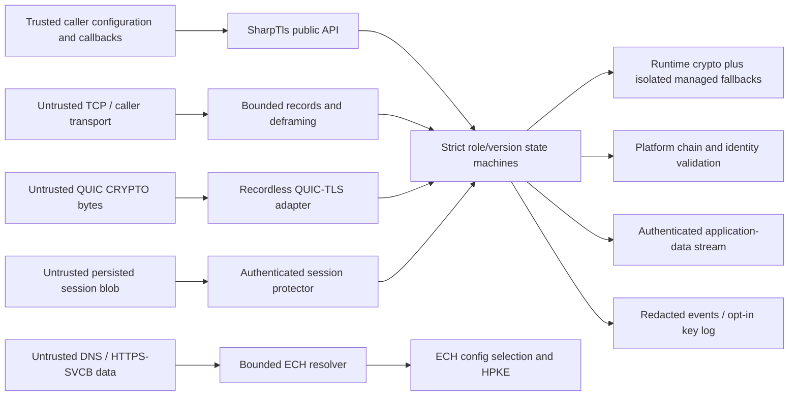

# SharpTls 1.0 threat model

## Status and scope

This document is the engineering threat-model baseline for the SharpTls 1.0 release
surface. It covers the pure managed .NET 9+ TLS 1.3 and restricted TLS 1.2 client/server
engines, uTLS-style ClientHello control, session state, ECH and protected-DNS bootstrap,
safe diagnostics, and the recordless QUIC-TLS adapters. It does not claim that an
independent cryptographic or protocol review has occurred. That review, hosted platform
evidence, and retained long-running fuzz campaigns remain separate release gates.

The normative protocol baseline and deliberate feature boundaries are recorded in
[ROADMAP.md](ROADMAP.md). The non-negotiable implementation rules are recorded in
[SECURITY.md](../SECURITY.md). If this document and those invariants disagree, the
stricter rule applies until the discrepancy is reviewed.

Threat-model version: 1.0 candidate 
Reviewed source baseline: `0.9.0-preview.1` 
Last updated: 2026-07-18

## Security objectives

SharpTls must provide all of the following simultaneously:

1. Authenticate the peer identity selected by the caller before ordinary application
   data is exposed.
2. Preserve confidentiality and integrity of handshake and application traffic under
   the negotiated TLS or QUIC-TLS key schedule.
3. Bind negotiation, certificates, PSKs, ECH state, ALPN, and Finished messages to the
   exact transcript and role.
4. Reject malformed, ambiguous, duplicate, unoffered, unsupported, replayed, or
   out-of-state protocol inputs without returning unauthenticated plaintext.
5. Keep attacker-controlled allocation, parsing, reassembly, retries, and callback work
   within explicit limits.
6. Keep traffic secrets private by default, zero owned secret buffers on replacement or
   disposal, and never accept fabricated connection secrets as authentication.
7. Preserve byte-exact ClientHello control without letting cosmetic fingerprint fields
   silently enable unimplemented or unsafe negotiated behavior.
8. Make replayable 0-RTT, key logging, deterministic entropy, and DNS fallback explicit
   opt-in policies whose risk cannot be enabled accidentally.

Availability against an attacker with unlimited bandwidth or connections is not a
guarantee. The objective is bounded work per connection/input plus operator-controlled
connection admission, timeouts, and concurrency.

## Assets

- Ephemeral ECDHE, X25519, ML-KEM/Kyber and HPKE private material.
- TLS 1.2 master secrets; TLS 1.3 early, handshake, application and exporter secrets.
- Record keys, IVs, sequence numbers, QUIC packet/header-protection keys and traffic
  secret events.
- Session tickets, resumption PSKs, external PSKs, server ticket-protection keys and
  persistent session-state encryption keys.
- Server and client private-key operations, including caller-owned external signers.
- Certificate-validation, hostname, ECH-acceptance, ALPN and application-settings
  outcomes.
- Private ECH server names, inner ClientHello contents and early application bytes.
- Integrity of ClientHello fingerprints, extension order, captured-profile provenance,
  and pre-send inspection results.
- Availability of parser, handshake, listener, DNS resolver and QUIC adapter resources.

## Trust assumptions

- The .NET runtime, JIT, garbage collector, operating system, process isolation,
  `RandomNumberGenerator`, runtime AEAD/hash/HMAC/RSA/ECDSA/ECDH implementations and
  platform X.509 chain provider are trusted dependencies.
- The host process and caller-supplied configuration are trusted to choose appropriate
  endpoints, trust roots, credentials, ticket keys, timeout policy and application
  protocol. SharpTls still validates and snapshots configuration before network I/O.
- Caller callbacks and external signers may fail, throw, cancel, delay, or re-enter.
  They are not allowed to mutate internal transcripts or traffic secrets.
- The network, DNS responses, TLS/QUIC peer, session-state file contents, imported
  captures/JSON, certificate messages, tickets and all record bytes are attacker
  controlled.
- A local attacker that can read process memory, debug the process, replace the runtime,
  alter loaded assemblies, or control an explicitly enabled NSS key-log sink is outside
  the confidentiality boundary.
- The managed FIPS 202/203, RFC 7748 and historical Kyber compatibility code is not a
  FIPS-validated module. Published-vector correctness is not a substitute for an
  independent side-channel and cryptographic review.

## Trust boundaries and data flows

The principal flows are:

- Client TCP: caller options → exact ClientHello → untrusted server flight → certificate,
  Finished and transcript authentication → protected application stream.
- Server TCP: untrusted ClientHello → strict version/profile-independent negotiation →
  optional client authentication → Finished authentication → application stream.
- ECH: authenticated or explicitly configured DNS transport → bounded ECHConfigList →
  HPKE-protected Inner plus public Outer → confirmation-bound acceptance or authenticated
  public-name rejection.
- Sessions: authenticated ticket issuance → bounded cache/protected persistence →
  origin/ALPN/hash/ECH-bound binder verification → resumed handshake.
- QUIC-TLS: caller-owned transport feeds ordered/overlap-checked CRYPTO bytes and consumes
  disposable traffic-secret/discard events; SharpTls never parses QUIC packets or streams.
- Diagnostics: immutable redacted events are safe by default; exact NSS secrets leave the
  boundary only after explicit caller acknowledgement.

## Threat analysis and controls

| ID | Threat | Required control and evidence |
|---|---|---|
| TM-01 | Length confusion, truncation, duplicate fields or allocation exhaustion in attacker-controlled wire/JSON/DNS inputs | `TlsBinaryReader`, record readers, deframers and protocol parsers validate enclosing lengths before slicing/allocation, consume complete inputs, reject duplicates/trailing data and enforce `TlsLimits`. Hostile corpus, truncation-at-every-offset and managed/coverage fuzz targets exercise these boundaries. |
| TM-02 | Handshake state confusion, cross-version message reuse or transcript omission | Separate TLS 1.2/TLS 1.3 client state and TLS 1.3 server state machines reject illegal transitions. Transcript owners retain exact handshake headers/bodies, HRR uses `message_hash`, and record headers/CCS are excluded. State-transition, HRR, downgrade and Finished-negative tests are mandatory. |
| TM-03 | Downgrade or selection of an unoffered version, suite, group, signature, ALPN or extension | Every negotiated field is checked against the immutable offer and its message context. TLS 1.2 requires EMS and secure-renegotiation signalling; TLS 1.0/1.1, renegotiation, CBC/RC4/3DES/static-RSA and SHA-1 authentication remain non-executable. |
| TM-04 | AEAD nonce reuse, sequence wrap, forged records or plaintext release after tag failure | Record ciphers derive RFC nonces from monotonic sequence numbers, fail before wrap, authenticate headers as AAD, enforce plaintext/ciphertext limits and zero failed plaintext. Authentication uses runtime `AesGcm`/`ChaCha20Poly1305`; tamper, padding, type, limit and exhaustion tests cover both versions. |
| TM-05 | Invalid-curve, low-order X25519, malformed ML-KEM/Kyber or hybrid component confusion | Runtime providers validate NIST points. Managed X25519 uses a fixed-iteration ladder and rejects all-zero shared secrets. Hybrid formats have construction-specific ordering, lengths, canonical-key checks and implicit rejection; component and combined secrets are zeroized. Official/accumulated vectors and invalid-key tests are retained. |
| TM-06 | Certificate, hostname, EKU or CertificateVerify bypass | System/custom-root chain validation, time/EKU/name policy and TLS CertificateVerify are independent mandatory gates. Signature scheme must match key OID/curve/PSS parameters and the exact TLS context. Callback evidence policy cannot override trust failure. Generated PKI and platform interop tests cover wrong name, expiry, trust, EKU and signatures. |
| TM-07 | Ticket forgery, cross-origin resumption, PSK index/hash confusion or replayed cache entry | Client tickets are single-offer owned, age/authentication capped and bound to origin, port, ALPN, hash and ECH source. Server ticket state is AES-256-GCM authenticated or held in bounded zeroizing caches. Identity-specific binders, HRR reconstruction and selected-index checks precede resumed state exposure. |
| TM-08 | 0-RTT replay or private early-data disclosure | Early data is disabled by default and requires explicit replay-risk acknowledgement plus ticket authorization. Only identity zero may authorize early data. TCP client retransmission is caller policy; QUIC server acceptance additionally requires an atomic anti-replay callback and compatible remembered transport limits. ECH rejection never retransmits private bytes to Outer. |
| TM-09 | ECH downgrade, acceptance spoofing, decryption oracle or Inner/Outer identity confusion | Acceptance requires constant-time RFC confirmation bound to the selected Inner transcript. Rejection authenticates the public name before retry configs are trusted. HRR reuses one HPKE context with empty retry `enc`; outer-extension reconstruction is order/identity bounded. Server initial open failures remain rejection, while accepted-HRR inconsistencies are fatal. |
| TM-10 | DNS spoofing, alias loops, ECH-stripping fallback or resolver bootstrap confusion | DNS messages, names, records, alias depth, retries, cache size and TTL are bounded. Protected DoT/DoH requires explicit bootstrap IP plus separately authenticated resolver name and never downgrades to plaintext. Origin SNI is preserved; all-ECH-compatible endpoints suppress direct fallback. The AD bit is not treated as local DNSSEC proof. |
| TM-11 | Callback reentrancy, mutation, secret retention or cancellation abuse | Public option collections and returned data are defensive snapshots. Observer callbacks receive redacted/immutable values; private-key operations are serialized and SPKI/scheme bound. Callback failure aborts the operation, cancellation propagates, and no callback receives mutable transcript/AEAD state. The NSS sink is the single explicit secret egress. |
| TM-12 | Server-side CPU/memory/connection exhaustion | Record, handshake, certificate, ticket, KeyUpdate, PHA, retry and listener work is bounded per connection. The caller owns admission control and accept-loop concurrency. Fuzz time/allocation budgets and benchmarks detect regressions; distributed connection floods remain an operator-layer concern. |
| TM-13 | QUIC packet/stream policy accidentally delegated to TLS | The QUIC adapter handles only TLS CRYPTO bytes, transport-parameter authentication, secret transitions and discard events. It rejects TLS KeyUpdate, enforces encryption-level ordering and overlap equality, and does not claim Retry integrity, packet protection integration, recovery, congestion control or stream safety. |
| TM-14 | Diagnostic leakage or forged success through low-level APIs | Default snapshots/events contain no handshake bytes or secrets. Key logging requires explicit exposure acknowledgement and a caller-owned sink. Production APIs do not inject master secrets, traffic secrets, sequence numbers, AEAD state or fabricated authenticated sessions. Temporary key-log copies are zeroized. |
| TM-15 | Build/package tampering or dependency substitution | Compiler output is deterministic/path-mapped; public API has a reviewed baseline; normalized NuGet/symbol packages are byte reproducible and clean-restored. CI actions are commit-SHA pinned, tag artifacts require platform, quality and public-interop jobs, and OIDC provenance attests release artifacts. Runtime package has no third-party dependency. Hosted run/attestation IDs remain external evidence. |
| TM-16 | Timing/cache side channels in managed cryptography | Secret equality uses fixed-time primitives and X25519 has a fixed iteration count. Managed ML-KEM avoids secret-dependent rejection outputs, but the CLR/JIT/GC provide no general constant-time guarantee for all managed arithmetic or memory copies. Independent review and platform measurements are required before 1.0; this residual risk cannot be closed by functional tests. |
| TM-17 | Cancellation, EOF, concurrent access or close races becoming successful truncation | Partial I/O loops require complete framing; unexpected EOF is fatal and only authenticated `close_notify` is clean. One reader and one writer may proceed concurrently while same-direction calls serialize. Disposal is idempotent and replaces/zeros owned secrets. Partial-stream, cancellation and close-race tests cover the contracts. |
| TM-18 | Exact legacy fingerprint offers causing unsafe negotiation | Wire-only identifiers may remain visible for fidelity, but the engine accepts only implemented AEAD/ECDHE algorithms and mandatory TLS 1.2 policy. Unknown/weak server selection fails. Exact 360/7.5 is buildable for inspection but rejected before I/O because it omits EMS. |
| TM-19 | ALPN/ALPS confusion causing the caller to speak the wrong application protocol | Selected ALPN must have been offered; ALPS code point and payload are bound to the selected ALPN and authenticated Finished. SharpTls exposes the result but never implements or silently dispatches HTTP/2/HTTP/3. The caller must refuse unsupported selected application protocols. |
| TM-20 | Fingerprint mimicry interpreted as anonymity or complete browser impersonation | SharpTls controls TLS-visible ClientHello and record fragmentation only. TCP behavior, HTTP framing/order, timing, traffic size, OS characteristics and application semantics remain observable. Documentation and API names must not claim browser anonymity or application-layer mimicry. |

## Abuse cases that must remain negative tests

- EOF at every record/header/vector boundary, oversized lengths, duplicate extensions,
  trailing bytes, invalid UTF-8 JSON property names and decompression bombs.
- ServerHello/HRR values that were not offered, a second HRR, changed HRR invariants,
  transcript forks, wrong Finished values and records with modified AAD/tag/type/padding.
- Expired, untrusted, wrong-name, wrong-EKU and malformed certificates; signature/key/OID
  mismatches; invalid delegated credentials and unauthorized client certificates.
- Expired/corrupted/cross-origin tickets, wrong PSK binder/index/hash, replayed early data,
  resumed ALPS mismatch and ECH-bound ticket use without the same ECH configuration.
- ECH confirmation mismatch, retry-config use before public-name authentication,
  non-empty retry `enc`, reordered/missing outer extensions and rejected-Outer PSK selection.
- QUIC CRYPTO gaps/conflicting overlaps, duplicate/role-invalid transport parameters,
  encryption-level regressions and acceptance without application anti-replay approval.
- KeyUpdate/PHA/ticket floods, sequence exhaustion, record-size-limit overruns, concurrent
  same-direction API use and callback reentrancy/failure.

The deterministic managed fuzz registry in `tools/SharpTls.Fuzz` and the SharpFuzz
adapter in `tools/SharpTls.CoverageFuzz` share the same parser/state-machine targets so a
retained crash reproducer can become an ordinary regression test.

## Residual risks and release blockers

The following are accepted preview risks, not completed 1.0 evidence:

- Independent cryptographic and side-channel review of managed X25519, FIPS 202/203,
  X25519MLKEM768 and historical Kyber compatibility code.
- Hosted Linux/macOS/Windows run IDs, including Linux/Windows platform-client interop
  against the SharpTls server and provider-specific X.509 behavior.
- Retained multi-day coverage-guided fuzz campaigns with tool/driver hashes, corpus
  before/after hashes, coverage and crash disposition.
- Interoperability evidence from a second independent QUIC transport and a second
  independent standard TLS client stack for the server surface.
- Runtime/JIT/GC behavior may retain copies outside explicitly owned zeroized arrays;
  zeroization limits lifetime but cannot prove process-memory erasure.
- Online revocation availability and platform chain-policy differences remain deployment
  concerns. `NoCheck` is test-only unless the caller has an explicit alternative policy.
- Traffic analysis can still distinguish record timing, sizes, TCP/QUIC behavior and
  application protocols despite a byte-exact ClientHello.
- Operator policy is still required for connection-rate limits, credential rotation,
  anti-replay storage durability, key-log file protection and incident response.

No release may convert one of these into a silent success path. A release can either
produce the required evidence, keep the feature preview/opt-in, or remove it from the
advertised 1.0 surface.

## Review and change control

Re-run and update this threat model when any of the following changes:

- supported TLS version, cipher suite, signature scheme, named group or HPKE suite;
- transcript construction, state transitions, Finished/binder logic or record nonce use;
- certificate, hostname, revocation, delegated-credential or client-authentication policy;
- ticket persistence, anti-replay, ECH/DNS bootstrap, QUIC secret events or diagnostics;
- parser/deframer limits, public callbacks, secret ownership or deterministic mode;
- runtime target, cryptographic provider, managed cryptographic implementation or package
  dependency;
- uTLS profile baseline or a profile begins advertising newly negotiable semantics.

For 1.0 sign-off, reviewers must map every reportable finding to the threat IDs above,
record its disposition, confirm no high-severity finding remains, and archive immutable
CI/fuzz/package provenance identifiers. Merely passing the local unit suite is not
sign-off.
